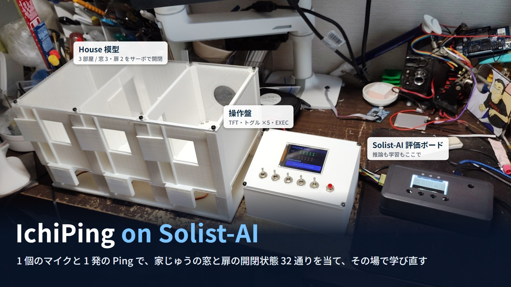
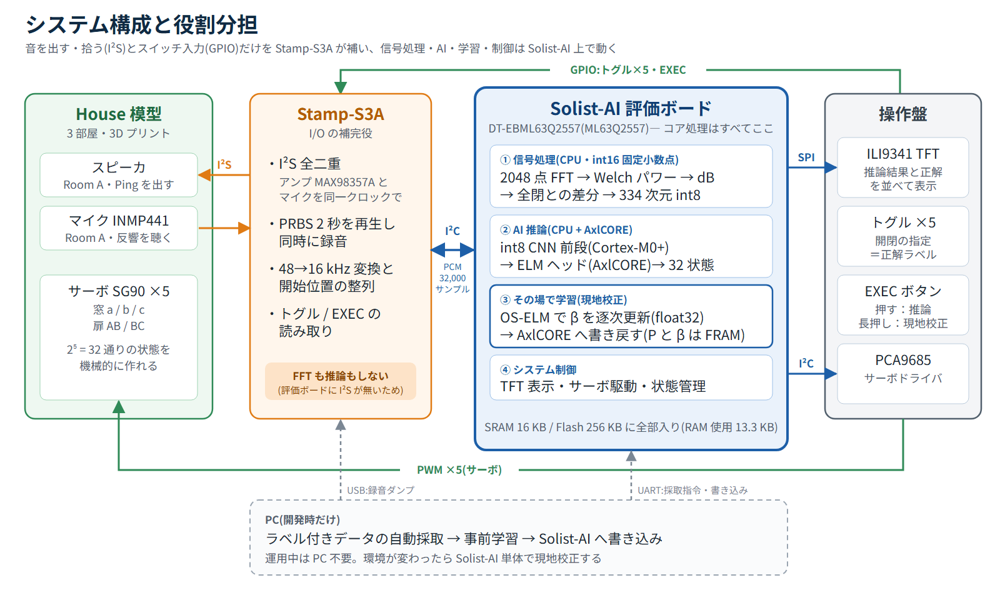

# IchiPing on Solist-AI

スピーカから 1 発の Ping(PRBS)を鳴らし、1 個のマイクで拾った反響から、3 部屋の窓 3 枚・扉 2 枚の開閉状態 32 通りを当てるエッジ AI。
特徴抽出・推論・その場での学び直し(オンデバイス学習)まで、ROHM Solist-AI 評価ボード(DT-EBML63Q2557 / ML63Q2557)の上で動く。
[IchiPing](https://protopedia.net/prototype/8470)(NXP FRDM-MCXN947 版)を Solist-AI へ移植した作品。

- 作品ページ(ProtoPedia):https://protopedia.net/prototype/8556
- PV(YouTube):https://youtu.be/eih0WZhSuuw
- ROHM EDGE HACK CHALLENGE 2026:https://rehc.jp/

## 結果

| 評価 | 32 クラス分類の正解率 | 14 クラス換算 |
|---|---|---|
| 実機サーベイ(事前学習モデル、2 回) | 100%(32/32、32/32) | 100% |
| 実機サーベイ(現地校正の後) | 100%(32/32) | 100% |
| 学習外のセッション(条件の異なる 4 グループ, PC で実機と同じ計算) | 99.2 / 99.9 / 95.8 / 100% → 平均 98.7% | 100% |

閉じた扉の向こうの状態(音響的には本来聞こえない)も含めて 32 クラスを当てている。保存するパラメータ数は約 4.36 万
(int8 CNN 前段 42,528 + ELM の β 1,024)で、PC 上の理想的な CNN(約 30 万)の約 1/7。

## 構成

| 処理 | 担当 |
|---|---|
| 特徴抽出(2048 点 FFT → 全閉との差分 → 334 次元 int8) | Solist-AI(CPU) |
| int8 CNN 前段(Conv1d 8/16/32 → FC 32) | Solist-AI(CPU) |
| ELM による 32 クラス推論 | Solist-AI(AxlCORE) |
| 現地校正(OS-ELM で β を逐次更新、float32、P・β は FRAM) | Solist-AI(CPU → AxlCORE) |
| TFT 表示・サーボ(PCA9685 + SG90 ×5)・状態管理 | Solist-AI |
| I²S のスピーカ再生・マイク録音、トグル / EXEC の読み取り | M5Stack Stamp-S3A |

Stamp-S3A は、評価ボードに I²S が無く、拡張端子の信号ピンが TFT・I²C・PCA9685 OE で埋まるため、I/O を補うためだけに使う。
詳しい設計判断・経緯・評価ルールは [docs/DEVELOPMENT.md](docs/DEVELOPMENT.md)。

## リポジトリ構成

| パス | 内容 |
|---|---|
| [firmware/IchiPingInference](firmware/IchiPingInference/README.md) | Solist-AI のファーム(推論 / サーベイ / データ採取)、PC 側ツール、書き込み用イメージ |
| [firmware/StampMeasure](firmware/StampMeasure/platformio.ini) | Stamp-S3A のファーム(PRBS 再生・録音・I²C サーバ、PlatformIO) |
| [hardware/stamp_s3a_interposer](hardware/stamp_s3a_interposer/README.md) | Stamp-S3A を載せる中間基板(KiCad)。発注データは [output/](output/jlcpcb/README.md) |
| [sim/](sim/) | 学習・評価スクリプト(モデル生成、固定小数点の特徴計算の参照実装、Sim 段階の検証) |
| [sim_export/](sim_export/README.md) | 完成版モデル・評価結果([solist_ds/](sim_export/solist_ds/README.md))と Sim 段階の成果物 |
| [docs/](docs/) | 開発記録([DEVELOPMENT.md](docs/DEVELOPMENT.md))、端子割り当て([io_allocation.md](docs/io_allocation.md))、配線ガイド([solist_connection.html](docs/solist_connection.html))、部品表([bom_tht.html](docs/bom_tht.html))、実機サーベイ結果([results/](docs/results/))、Sim 段階の検証レポート([index.html](docs/index.html))、作品ページの画像([protopedia/](docs/protopedia/)) |
| [media/](media/README.md) | PV と作品ページの素材(撮影動画・写真・図の原本)、PV の制作条件と再生成スクリプト |
| [samples/](samples/README.md) | 特徴計算の照合用の音声サンプル |

動画と写真の原本(`media/`)は Git LFS で管理している(`git lfs pull`)。

## 使い方(概要)

1. Stamp-S3A に `firmware/StampMeasure` を書き込む(PlatformIO)。
2. Solist-AI に `firmware/IchiPingInference/prebuilt/ichiping_infer.flash.bin` を書き込む(`tools/flash.ps1`)。
3. 電源を入れると全閉を 3 回測って基準にする。トグルで窓・扉を決めて EXEC を押すと推論、EXEC を 2 秒長押しすると現地校正。

ビルド・サーベイ・データ採取の手順は [firmware/IchiPingInference/README.md](firmware/IchiPingInference/README.md)、
モデルの再生成は [sim_export/solist_ds/README.md](sim_export/solist_ds/README.md)。
